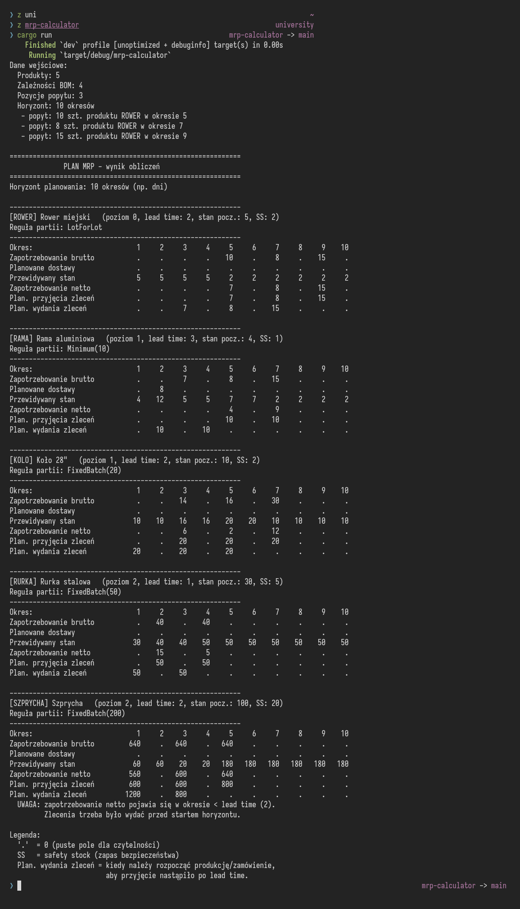
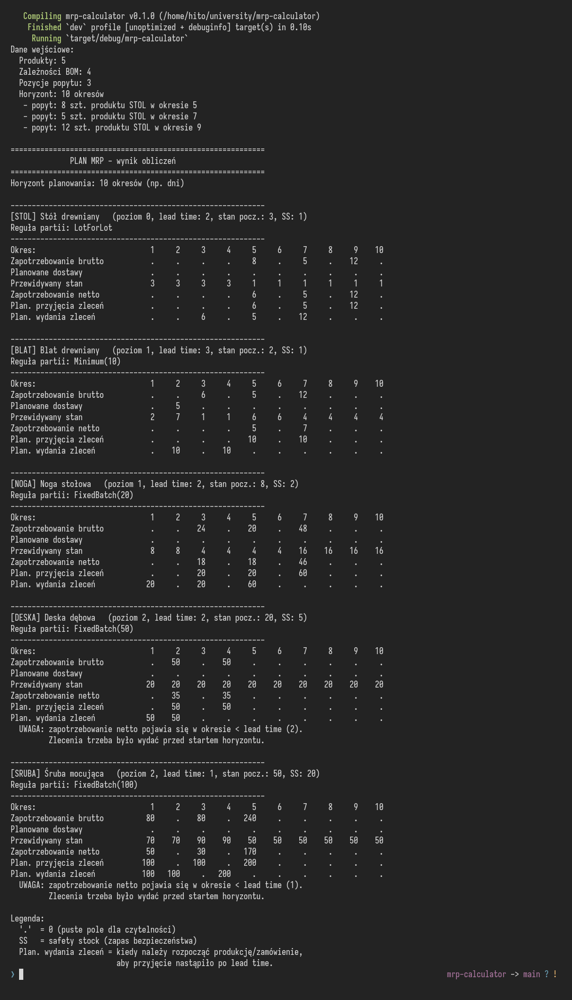

# MRP Calculator

Prosta aplikacja konsolowa w Rust obliczająca zapotrzebowanie materiałowe zgodnie z algorytmem **MRP** (Material Requirements Planning).

## Funkcje

- Wielopoziomowa struktura BOM (przykład: 3 poziomy)
- Czas realizacji (lead time) produkcji i dostawy
- Stan początkowy magazynu (on hand)
- Zapas bezpieczeństwa (safety stock)
- Zaplanowane wcześniej dostawy (scheduled receipts)
- Trzy reguły wielkości partii:
  - `LotForLot`: dokładnie tyle ile potrzeba
  - `FixedBatch(n)`: wielokrotności `n`
  - `Minimum(n)`: co najmniej `n`
- Ostrzeżenie o spóźnionych zleceniach (gdy potrzeba przekracza lead time)

## Przykładowe działanie

<details><summary>Obliczenia dla roweru</summary>



</details>

<details><summary>Obliczenia dla drewnianego stołu</summary>



</details>

## Uruchomienie

```bash
cargo run
```

Program wypisze tabelę MRP dla każdego produktu z przykładowego scenariusza (stół → blat + 4 nogi → deski / śruby).

## Struktura kodu

| Plik                         | Opis                                                       |
| ---------------------------- | ---------------------------------------------------------- |
| [src/main.rs](src/main.rs)   | Dane wejściowe (produkty, BOM, popyt) i wywołanie obliczeń |
| [src/item.rs](src/item.rs)   | Definicje struktur `Item`, `BomLink`, `LotSize`            |
| [src/mrp.rs](src/mrp.rs)     | Właściwy algorytm MRP                                      |
| [src/print.rs](src/print.rs) | Formatowanie tabeli wynikowej                              |

## Jak zmienić scenariusz

Edytuj listy w [src/main.rs](src/main.rs):

```rust
// Produkty (id, nazwa, poziom BOM, lead time, stan początkowy)
let items = vec![
    Item::new("ROWER", "Rower miejski", 0, 2, 5)
        .with_safety_stock(2)
        .with_lot_size(LotSize::LotForLot),
    // ...
];

// Zależności BOM (rodzic, dziecko, ilość na 1 szt. rodzica)
let boms = vec![
    BomLink { parent: "ROWER".into(), child: "RAMA".into(), qty: 1 },
    // ...
];

// Popyt niezależny: (id produktu, okres, ilość)
let demand = vec![
    ("ROWER".to_string(), 4, 10),
    // ...
];

let periods = 10; // horyzont planowania
```

## Interpretacja wyniku

Dla każdego produktu wypisywana jest tabela z wierszami:

- **Zapotrzebowanie brutto**: łączny popyt (zewnętrzny + ze zleceń rodziców)
- **Planowane dostawy**: dostawy już zamówione, w drodze
- **Przewidywany stan**: stan magazynu na koniec okresu
- **Zapotrzebowanie netto**: brakująca ilość po uwzględnieniu stanu
- **Plan. przyjęcia zleceń**: kiedy zlecenie musi być gotowe
- **Plan. wydania zleceń**: kiedy zlecenie należy rozpocząć (cofnięte o lead time)

Symbol `.` w tabeli oznacza zero (dla czytelności).
